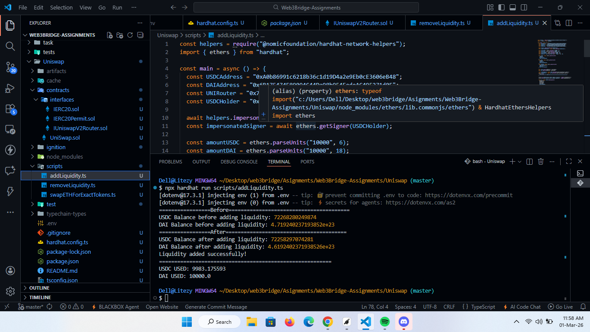
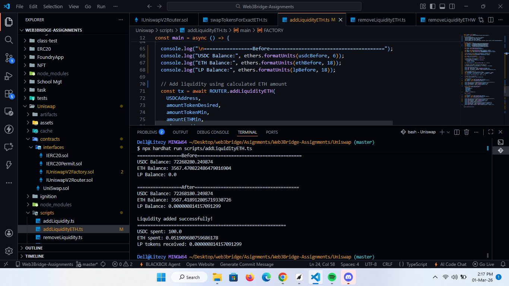
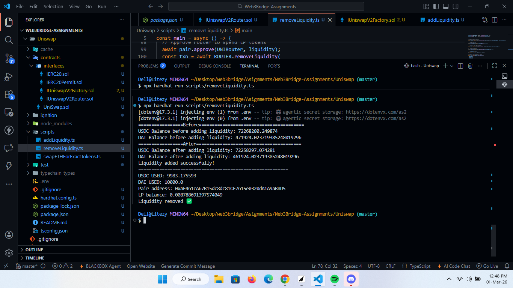
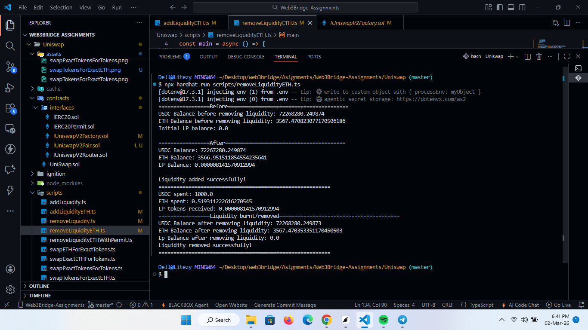
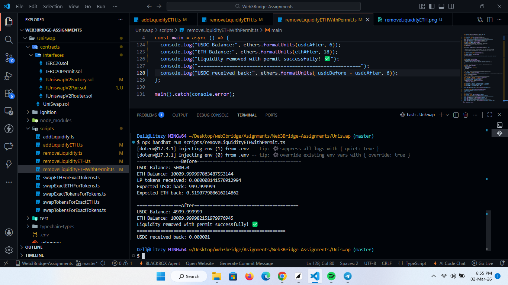
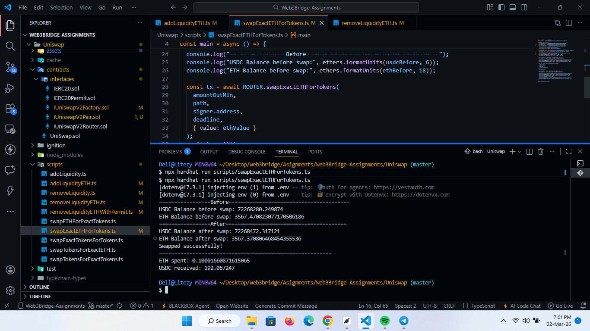
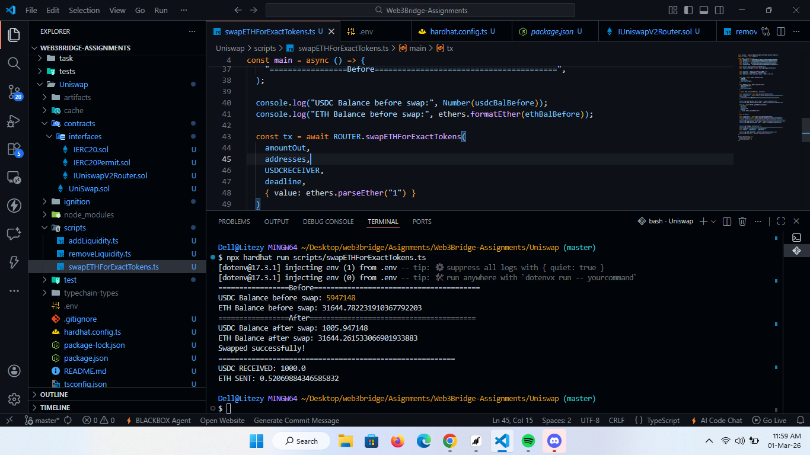
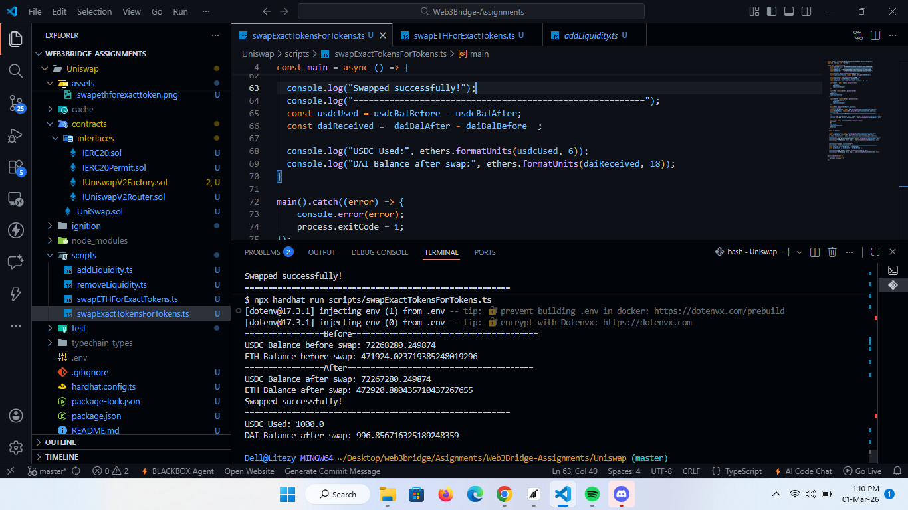
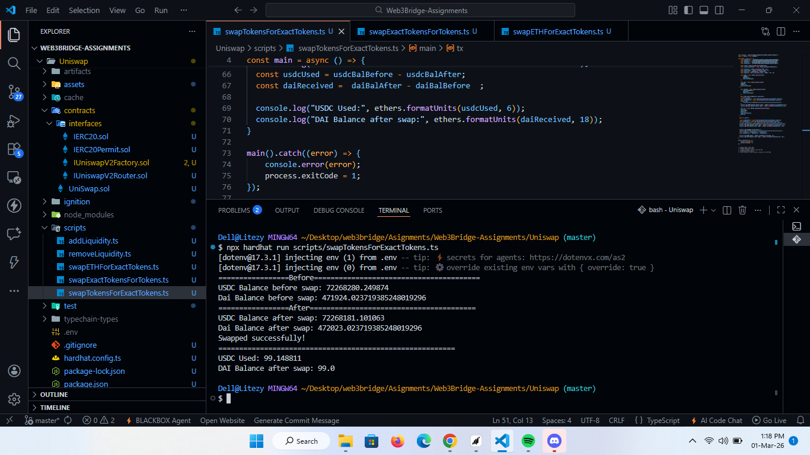
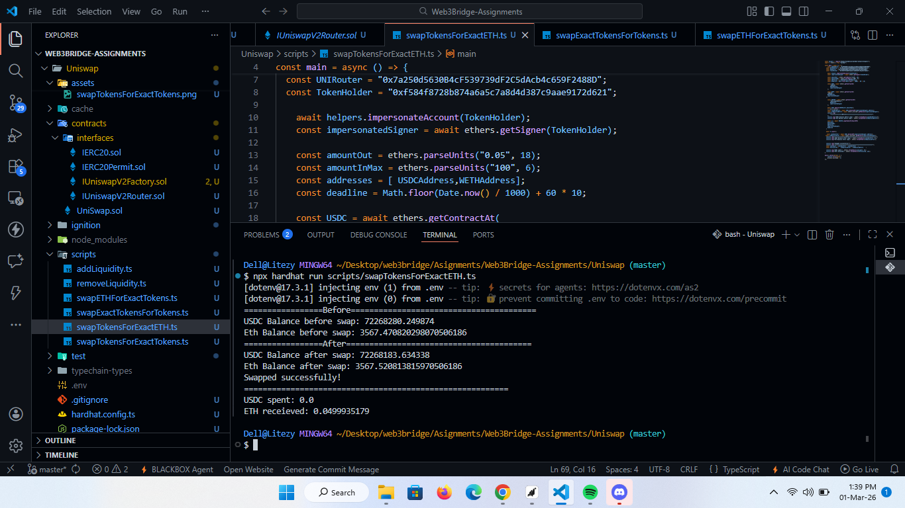

# Sample Hardhat Project

This project demonstrates a basic Hardhat use case. It comes with a sample contract, a test for that contract, and a Hardhat Ignition module that deploys that contract.

Try running some of the following tasks:

```
shell
npx hardhat help
npx hardhat test
REPORT_GAS=true npx hardhat test
npx hardhat node
npx hardhat ignition deploy ./ignition/modules/Lock.ts
```

## Uniswap Operations Guide

This section demonstrates various Uniswap V2 operations including liquidity provision and token swaps.

### Liquidity Operations

These operations allow you to add and remove liquidity from Uniswap pools.

| Operation | Description |
|-----------|-------------|
| **Add Liquidity** | Add liquidity to a token pair |
|  |
| **Add Liquidity ETH** | Add liquidity with ETH |
|  |
| **Remove Liquidity** | Remove liquidity from a token pair |
|  |
| **Remove Liquidity ETH** | Remove liquidity and receive ETH |
|  |
| **Remove Liquidity ETH With Permit** | Remove liquidity using permit signature |
|  |

### Swap Operations

These operations allow you to swap tokens on Uniswap.

| Operation | Description |
|-----------|-------------|
| **Swap Exact ETH For Tokens** | Swap exact amount of ETH for tokens |
|  |
| **Swap ETH For Exact Tokens** | Swap ETH for exact amount of tokens |
|  |
| **Swap Exact Tokens For Tokens** | Swap exact amount of tokens for other tokens |
|  |
| **Swap Tokens For Exact Tokens** | Swap tokens for exact amount of other tokens |
|  |
| **Swap Exact Tokens For ETH** | Swap exact amount of tokens for ETH |
|  |
| **Swap Tokens For Exact ETH** | Swap tokens for exact amount of ETH |
|  |
